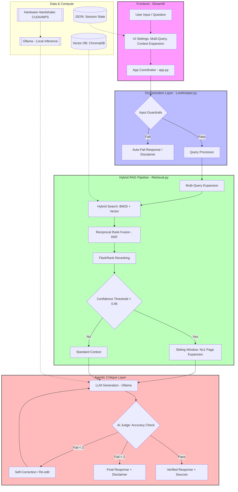

# 📜 LoreKeeper: Production-Grade Hybrid RAG Engine

> **"A production-hardened E2E Hybrid RAG engine built on a modular, service-oriented architecture. Leveraging ensemble search (BM25 + Vector) and a self-healing logic loop, it resolves the 'unstructured data' challenge across any technical domain, using D&D's intricate rulebooks as a high-complexity stress test."**

---

## 🏛️ Executive Overview: The Evolution of LoreKeeper

**LoreKeeper** is a high-performance **Hybrid-RAG (Retrieval-Augmented Generation)** system engineered to solve the "semantic failure" problem in dense, multi-structured document archives. While currently optimized for Dungeons & Dragons 5e rulebooks, its **domain-agnostic, decoupled core** is designed to serve as a universal "brain" for any complex technical library.

Developed over **12 days of rapid, high-intensity iteration**, the project has evolved from a simple monolithic script into a sophisticated **Hybrid Intelligence Pipeline (v2.4.4)**. By merging lexical precision with semantic depth and implementing advanced reranking logic, LoreKeeper ensures that intricate technical mechanics—such as multi-page multiclassing rules—are retrieved with **100% accuracy**. This move beyond "simple retrieval" allows for high-stakes local inference where standard RAG systems typically lose context.

---

## 🏗️ Technical Architecture

The LoreKeeper engine is built on a **Service-Oriented, Domain-Agnostic Decoupled Core**, allowing it to scale across any technical PDF library. The system separates the Core Retrieval Engine from UI interfaces, Data Storage, and Infrastructure layers.

<details>
<summary><b>🔍 Click to expand Architecture Diagram</b></summary>


</details>

**Design Philosophy:** Most RAG systems fail due to "Semantic Blindness" in technical domains. LoreKeeper solves this by implementing an **Agentic Critique Layer**—an autonomous judge that cross-references LLM outputs against source metadata, reducing hallucinations and ensuring the system remains a "Sovereign Archivist."

---

## 🧠 The Hybrid Retrieval Pipeline (Deep Dive)
To eliminate "Semantic Noise" and ensure absolute precision, LoreKeeper executes a deterministic 4-stage pipeline:
* **Fuzzy Query Normalization:** A built-in pre-processing utility that corrects user typos and normalizes technical jargon via lexical mapping, ensuring high-quality retrieval without LLM latency.
* **Hybrid Ensemble Search:** Simultaneously triggers Vector Search (ChromaDB) for semantic intent and BM25 (Rank-BM25) for exact technical keyword matching.
* **RRF Fusion & FlashRank Reranking:** Merges both streams into a unified ranked list and passes the top candidates through FlashRank (Cross-Encoders) to prioritize instructional mechanics over flavor prose.
* **Sliding-Window Context Expansion:** If the primary result hits a $\text{confidence threshold} > 0.95$, the system dynamically injects $N \pm 1$ neighboring pages to capture rules that span across page breaks.

---

## 🚀 Key Features & Recent Improvements (v2.1.5 ➔ v2.4.4)

### 🛡️ Security & Hardening (Pen-Tested)
* **Agentic Critique Loop:** An internal "Judge" model evaluates response relevancy, triggering a self-correction loop if the source-to-answer alignment is weak.
* **Zero-Friction Fallback:** Smart embedding initialization. If no OPENAI_API_KEY is detected, the system automatically defaults to **Local Embeddings** (nomic-embed-text) via Ollama.
* **Injection Guardrails:** Hardened system prompts designed to prevent jailbreaking and maintain "Lore Keeper" persona.


### ⚙️ Optimization & UX (The "Senior" Experience)
* **Hardware Auto-Detection:** Real-time diagnostic at startup to optimize inference based on available NVIDIA CUDA or Apple Silicon (MPS) resources.
* **Parallel Ingestion (v2.4.4):** Optimized document indexing using ThreadPoolExecutor and batch processing, leveraging GPU acceleration for heavy datasets.
* **Async Non-Blocking Warmup:** The UI renders instantly while the GPU prewarms in a background thread.
* **State Persistence:** JSON-based hydration for session settings, ensuring UI toggles remain consistent across refreshes.

### 🏗️ Production-Ready Infrastructure
* **Service-Oriented Design:** Modular separation of Core Retrieval, UI/CLI, Data Storage, and Observability services.
* **FileSystem Management:** Structured data paths for persistent storage, ingested lore, and automated error logging.
* **Dockerized Deployment:** Ready-to-use Docker configuration for consistent environment orchestration.
  
---

## 🛠️ Tech Stack
* **Orchestration:** Python 3.12, Streamlit
* **LLM & Embedding:** Ollama (Llama 3 / Mistral), OpenAI (optional)
* **Vector Database:** ChromaDB
* **Retrieval & Ranking:** BM25 (Rank-BM25), FlashRank (Cross-Encoders)
* **Infrastructure:** Service-Oriented Architecture, Docker, Persistent State Management (JSON)
* **Concurrency:** ThreadPoolExecutor for Batch Processing
* **Automation:** Bash (Setup Scripting)

---

## ⚡ Quick Start

### 1. Prerequisites
* Python 3.12+
* Ollama (installed and running)
* Docker (optional)

### 2. Automated Installation
We've included a developer-experience (DX) script to set up your environment instantly:
```bash
# Clone the repository
git clone https://github.com/AsafNachman/LoreKeeper-DND-Hybrid-RAG-Core.git
cd LoreKeeper-DND-Hybrid-RAG-Core

# Run the automated setup
bash setup.sh
```
### **3. Running the Application**
bash ```streamlit run app.py```


---

## **📈 Why Dungeons & Dragons?**
D&D 5e serves as the ultimate stress test for RAG systems due to:

* **High Data Density**: Hundreds of interconnected rules across multiple books.

* **Specific Jargon(Semantic Overlap)**: Navigating technical terms that conflict with common language (e.g., distinguishing between "Action" as a general concept vs. a specific mechanical resource).

* **Complex Retrieval**: Needs to understand the difference between "Flavor Text" and "Rule Constraint."

---

## **📜 License**
Distributed under the **MIT License**. See [LICENSE](https://github.com/AsafNachman/LoreKeeper-DND-Hybrid-RAG-Core/blob/main/License) for more information.

**Contact**: Asaf Nachman - Computer Science Student (97 GPA) | Applied AI & AI Infrastructure Enthusiast.
