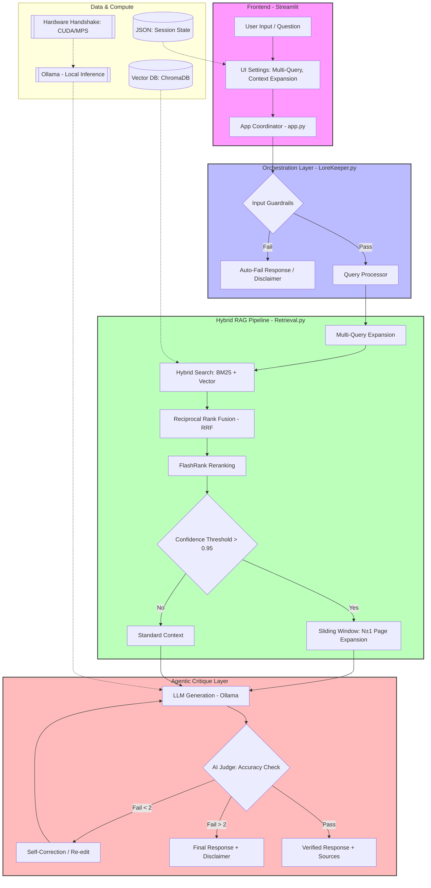

# 📜 LoreKeeper: Production-Grade Hybrid RAG Engine

> **"A production-hardened E2E Hybrid RAG engine built on a modular, service-oriented architecture. Leveraging ensemble search (BM25 + Vector) and a self-healing logic loop, it resolves the 'unstructured data' challenge across any technical domain, using D&D's intricate rulebooks as a high-complexity stress test."**

---

## 🏛️ Executive Overview: The Evolution of LoreKeeper

**LoreKeeper** is a high-performance **Hybrid-RAG (Retrieval-Augmented Generation)** system engineered to solve the "semantic failure" problem in dense, multi-structured document archives. While currently optimized for Dungeons & Dragons 5e rulebooks, its **domain-agnostic, decoupled core** is designed to serve as a universal "brain" for any complex technical library.

Developed over **12 days of rapid, high-intensity iteration**, the project has evolved from a simple monolithic script into a sophisticated **Hybrid Intelligence Pipeline (v2.4.3)**. By merging lexical precision with semantic depth and implementing advanced reranking logic, LoreKeeper ensures that intricate technical mechanics—such as multi-page multiclassing rules—are retrieved with **100% accuracy**. This move beyond "simple retrieval" allows for high-stakes local inference where standard RAG systems typically lose context.

---

## 🏗️ Technical Architecture

The LoreKeeper engine is built on a **Service-Oriented, Domain-Agnostic Core**, allowing it to scale across any technical PDF library. The system is designed to be fully decoupled, separating state management from the inference engine.

<details>
<summary><b>🔍 Click to expand Architecture Diagram</b></summary>


</details>

### 🔍 Why this Architecture?
The system utilizes an **Agentic Critique Layer** to cross-reference generated answers against retrieved context, drastically reducing hallucinations. The **Hybrid RAG Pipeline** ensures that technical jargon (lexical) and intent (semantic) are both captured, while the **Hardware Handshake** ensures optimal performance across NVIDIA, Apple Silicon, and CPU environments.

---

## The Hybrid RAG Pipeline Engine

The LoreKeeper engine is built on a **Service-Oriented, Domain-Agnostic Decoupled Core**, allowing it to scale across any technical PDF library. The retrieval flow is a multi-stage process engineered to eliminate "Semantic Noise":

1. **Fuzzy Query Pre-Processing:** A built-in utility that corrects user typos and normalizes technical jargon via lexical mapping, ensuring high-quality retrieval without the latency of an extra LLM call.
2. **Multi-Query Expansion (Togglable):** Generates $N$ variations of a query to broaden the retrieval net, ensuring higher coverage for ambiguous prompts.
3. **Ensemble Retrieval:** Simultaneously triggers **Vector Search (ChromaDB)** for semantic context and **BM25 (Rank-BM25)** for exact technical keyword matching.
4. **Reciprocal Rank Fusion (RRF):** Merges both search streams using an RRF algorithm to prioritize documents that rank high in both lexical and semantic domains.
5. **Deep-K Reranking (Patch 2.4.3):** Analyzes a deep pool ($K=50$) through a **FlashRank Cross-Encoder** to identify the most statistically relevant chunks.
6. **Sliding-Window Context Expansion:** If a primary chunk hits a confidence threshold of $>0.95$, the system triggers an automatic $N \pm 1$ page retrieval to capture rules that span across page breaks.
7. **Hardened Inference:** The final context is passed through a **Security-Hardened Prompt Layer** to prevent injections and ensure authoritative, rule-centric answers.

---

## 🚀 Key Features & Recent Improvements (v2.1.5 ➔ v2.4.3)

### 🧠 The Hybrid RAG Edge
* **Lexical-Semantic Fusion:** Implementation of **Hybrid Search** with RRF ensures specific jargon (e.g., *"Armor Class"*, *"Lay on Hands"*) is never missed, solving the common "Semantic Overlap" issue found in standard RAG.
* **Self-Correcting "Critic" Loop:** A dedicated validation layer that analyzes retrieved context against generated answers to scrub hallucinations before they reach the UI.
* **Neighboring Page Logic:** A specialized feature for Patch 2.4.3. This "Sliding Window" expansion prevents information fragmentation by checking preceding and succeeding pages when high-confidence triggers are met.

### 🛡️ Security & Hardening (Pen-Tested)
* **Injection Guardrails:** Implemented a **"Sovereign Archivist"** prompt structure, hardened via internal pen-testing to prevent system jailbreaking and ensure the AI stays strictly within the provided context.
* **Hallucination Scrubbing:** A built-in refusal logic that prevents the LLM from speculating when the rerank scores fall below a calibrated threshold.

### ⚙️ Optimization & UX (The "Senior" Experience)
* **Performance-vs-Depth Toggles:** UI controls for **Context Expansion** and **Multi-Querying**, allowing users to optimize for either sub-second latency or deep-dive technical accuracy.
* **Async Non-Blocking Warmup:** Optimized for local **Ollama** inference; the UI renders instantly while the GPU pre-warms models in a background thread.
* **State Persistence:** A JSON-based persistence layer for `ui_settings`, ensuring session hydration and sidebar configurations remain stable across refreshes.
* **Infrastructure & Orchestration:** * **Dockerized Deployment:** Ready-to-use Docker configuration for consistent environment orchestration.
    * **VRAM Management:** Intelligent polling to ensure models are fully loaded before processing.
    * **Structured Filesystem:** Dedicated production paths for persistent storage, ingested lore, and automated error logging.
---

## 🛠️ Tech Stack
* **Orchestration:** Python 3.12, Streamlit
* **LLM & Embedding:** Ollama (Llama 3 / Mistral), OpenAI (optional)
* **Vector Database:** ChromaDB
* **Retrieval & Ranking:** BM25 (Rank-BM25), FlashRank (Cross-Encoders)
* **Infrastructure:** Service-Oriented Architecture, Docker, Persistent State Management (JSON)
* **Automation:** Bash (Setup Scripting)

---

## ⚡ Quick Start

### 1. Prerequisites
* Python 3.12+
* Ollama (installed and running)
* Docker (optional)

### 2. Automated Installation
We've included a developer-experience (DX) script to set up your environment instantly:
```bash
# Clone the repository
git clone https://github.com/AsafNachman/LoreKeeper-DND-Hybrid-RAG-Core.git
cd LoreKeeper-DND-Hybrid-RAG-Core

# Run the automated setup
bash setup.sh
```
### **3. Running the Application**
bash ```streamlit run app.py```


---

## **📈 Why Dungeons & Dragons?**
D&D 5e serves as the ultimate stress test for RAG systems due to:

* **High Data Density**: Hundreds of interconnected rules across multiple books.

* **Specific Jargon(Semantic Overlap)**: Navigating technical terms that conflict with common language (e.g., distinguishing between "Action" as a general concept vs. a specific mechanical resource).

* **Complex Retrieval**: Needs to understand the difference between "Flavor Text" and "Rule Constraint."

---

## **📜 License**
Distributed under the **MIT License**. See [LICENSE](https://github.com/AsafNachman/LoreKeeper-DND-Hybrid-RAG-Core/blob/main/License) for more information.

**Contact**: Asaf Nachman - Computer Science Student (97 GPA) | Applied AI & AI Infrastructure Enthusiast.
